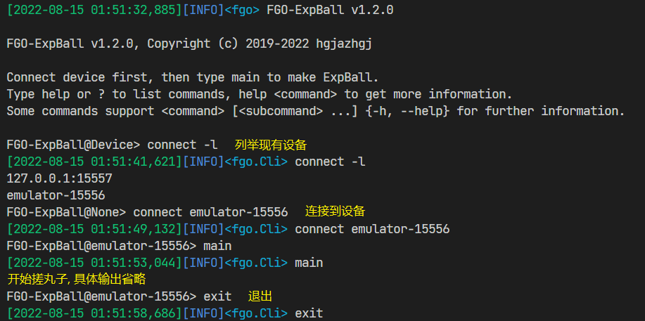

# 基于FGO-py的丸子制造机

FGO-ExpBall是专门用来搓丸子的程序,如果你不知道什么是[FGO-py](https://github.com/hgjazhgj/FGO-py),就先去看看吧  
所谓的搓丸子是把若干张低星礼装喂成一个,以保留其中的经验,并在喂给高星强化对象时节约QP的操作  

## 特性

- 全自动免配置跨平台开箱即用的搓丸子
- 自动对游戏内贩卖/强化时的筛选与排序进行设定,保证账户资产安全
- 稀有召唤(哈贝喵/活动三星礼装等所有你认为值得上锁的对象)自动上锁
- 独立项目,专门用来搓丸子
- 所需依赖是FGO-py的子集,如果你已有FGO-py,可直接附加而无需配置任何环境

## 警告

尽管本项目已经采取了充分必要的手段尽可能地保证你的账户资产安全,但是仍强烈建议你把重要物品上锁甚至放入灵基保管室  
特别注意三星礼装狗粮和高星从者  
在搓丸子前几轮运行时请**密切关注程序行为**,发现有任何看起来不对的情况请立即使用包括但不限于以下手段使程序失能,然后再考虑是不是真的有问题  

- 按下锁屏按钮
- 按下Home键或切换多任务
- 在控制台窗口中按下或连击Ctrl-C
- 关闭控制台窗口

## 运行

`FGO-ExpBall/fgoExpBall.py`是主程序,使用方法同FGO-py的cli,如果在一个现代化的终端(如WindowsTerminal)而非古老的CMD中运行,可以享受类bash的历史命令重放以及tab补全等功能  
主要命令就两个:  

- connect \<serial\>  连接设备,见FGO-py的[连接到设备](https://github.com/hgjazhgj/FGO-py#连接到设备-connect-your-device)章节
- main                搓丸子,**在任意游戏画面右下角显示「菜单」按钮的界面启动**

  
其他命令请请自己help查看  

如果已有安装好的portable FGO-py(可在[FGO-py的release](https://github.com/hgjazhgj/FGO-py/releases/tag/v2022.06.12)或[FGO-py官网](https://fgo-py.hgjazhgj.top/)获取),可按本项目的release操作,或是直接在portable FGO-py的根目录下clone本项目  
由于搓丸子需要由程序本身而非玩家对游戏中的设置进行调整以保证账户资产安全从而并不符合FGO-py「小而美」的一贯设计风格,所以做成了一个独立项目  
**在游戏内设定友情池的自动变还选项与商店贩卖从者的类别筛选**,别处的选项会自动设定  
程序会贩卖三星礼装所以不要在游戏内勾选自动变还三星礼装以防活动礼装被贩卖  
建议的选项是「自动变还-12星经验值」「商店-从者」  
程序暂无典型的结束标志,以下情况会导致程序空转或效率低下  

- 从者仓库被\<被排除在贩卖筛选之外的对象\>占满(e.g.一仓库狗粮),灵基保管室也没有多余空间
- 同一礼装的丸子数量太多(e.g.选择「饥饿」作为强化对象但是仓库里已经有28张lv.50的「饥饿」)

由于上述情况需要相当长的时间(数小时至数日不等,依照不同的变还设定)才会出现,所以请在发现这种情况时手动停止运行~~更多的情况是游戏先闪退然后程序熔断~~  

## 自动上锁

将你认为重要的召唤物自动上锁,默认配置为哈贝喵,同时unused中有Saber lily备用  
安哥拉曼纽会由游戏上锁,就像5星从者一样,不要将安哥拉曼纽放入自动上锁中  
本功能原理同FGO-py的助战筛选,你可以设置其他重要召唤物,具体见FGO-py readme,但是有以下区别:  

- 没有透明度通道,黑色就会被认为是黑色
- 不能热更改图片,需要在程序运行前调整好

此外,如果一次抽出了至少两个重要召唤物,无论是相同还是不同,程序都会立刻停止运行,可以慢慢品一品然后截图晒卡什么的  

## 一些数据

内容有点长,所以发到[B站专栏](https://www.bilibili.com/read/cv18100391)了,如果能有点赞和投币我会很开心  

## 更新日志

### 2022/10/21 v1.6.2

Fix:merge [pr #6](https://github.com/hgjazhgj/FGO-ExpBall/pull/6)  

### 2022/10/20 v1.6.1

Upd:万圣活动礼装  
我经常忘记更改版本号(其实根本不需要版本号这种东西但我还是想有一个),不知道有没有什么技术手段提醒我或者帮我检查版本号是否更新  
Opt:试图缓解强化卡顿造成的熔断  

### 2022/10/18 v1.6.0

Add:万圣活动礼装  
往期万圣的活动礼装加入备用  
[issue #3](https://github.com/hgjazhgj/FGO-ExpBall/issues/3)怎么修比较优雅还没想好,感觉各种方案都不如仓库里留一个上了锁的低星好  

### 2022/09/09 v1.5.3

Add:反活动加成筛选  
Opt:部分延时调整  

### 2022/09/08 v1.5.2

Add:泳装活动礼装  

### 2022/08/30 v1.5.1

Opt:移除summon_fp  

### 2022/08/27 v1.5.0

Add:screenshot命令  

### 2022/08/22 v1.4.3

Fix:Windows调试下仅点击时的成员缺失  

### 2022/08/20 v1.4.2

Fix:把狗粮塞进灵基保管室时筛选设定滚动条至底部  
同时应对并非完全滚动到底部的情形  

### 2022/08/20 v1.4.1

Fix:offset  

### 2022/08/20 v1.4.0

Fix:当把满级丸子编入队伍或助战导致即使开启智能筛选而强化对象列表中前几个仍不能选择时选择后面可选的作为强化对象  
如果一整页都是这样的情况,那你搓nm的丸子呢  
Opt:掉落截图放进fgoLog中  

### 2022/08/15 v1.3.0

Opt:贩卖时增加对贩卖结果弹窗的等待以防网络状态不那么好的时候熔断  

### 2022/08/14 v1.2.0

Opt:在搓完一轮丸子后返回主界面以触发FGO的GC  
真不愧是你啊FGO,连个基本的垃圾回收都写得一坨屎,我几年前C语言大作业都写得比这好...  
此前最多一次积攒了大约27G的垃圾内存把我页面文件都撑大了1/3(我VM heap开得很大),这样GC一下硬错误少了游戏都流畅得多  
相关特性有待进一步研究,尚不清楚FGO-py是否也需要这样的操作  
Opt:延时调整  

### 2022/08/14 v1.1.0

Add:将狗粮芙芙放进灵基保管室  
使搓丸子能够更长时间地持续运行,如果自动贩卖掉芙芙,就能持续更长时间  

### 2022/08/13 v1.0.0

Add:main -a参数轮数限制  
「抽友情-贩卖-强化」为一轮  
Fix:特殊召唤识别阈值调整  
Del:备用的安哥拉曼纽特殊召唤模板  
Opt:熔断器计数减少  
Opt:增加日志  
Opt:全选后加延时  
Add:特殊召唤后截图  

### 2022/08/12 v0.1.2

Fix:文本与版本号  

### 2022/08/11 v0.1.1

Fix:丸子搓满级就完成强化前往召唤  
脑测修复  
Opt:优化按钮生成  

### 2022/08/11 v0.1.0

Add:.github  

### 2022/08/10 v0.0.2

Fix:将所有的FGO-py替换为FGO-ExpBall  

### 2022/08/10 v0.0.1

init  
好消息:FGO-py终于有搓丸子了  
坏消息:搓丸子不属于FGO-py  
本项目复用了FGO-py中许多已经成熟的代码,同时依照需要自动更改游戏内设置的需求引入了一个简陋的按钮系统~~没错我跟alas学的~~  
事实证明这个框架完美胜任了当前的工作,使得本项目在保证代码质量的同时从新建文件夹到全部完工只用了8小时(上午8点-下午4点),并且几乎一遍完工,测试才花了半小时不到,只不过代码看起来有些又臭又长,并且全是大写字母...这也是为什么不直接写在FGO-py里面的原因  
本次是一个成功的尝试,后续的想法是进一步将FGO-py的模块通用化出来,但还是先看看有没有bug吧  
另外,本人尚未通关2.6,所以本人暂时无法进行大量测试  
